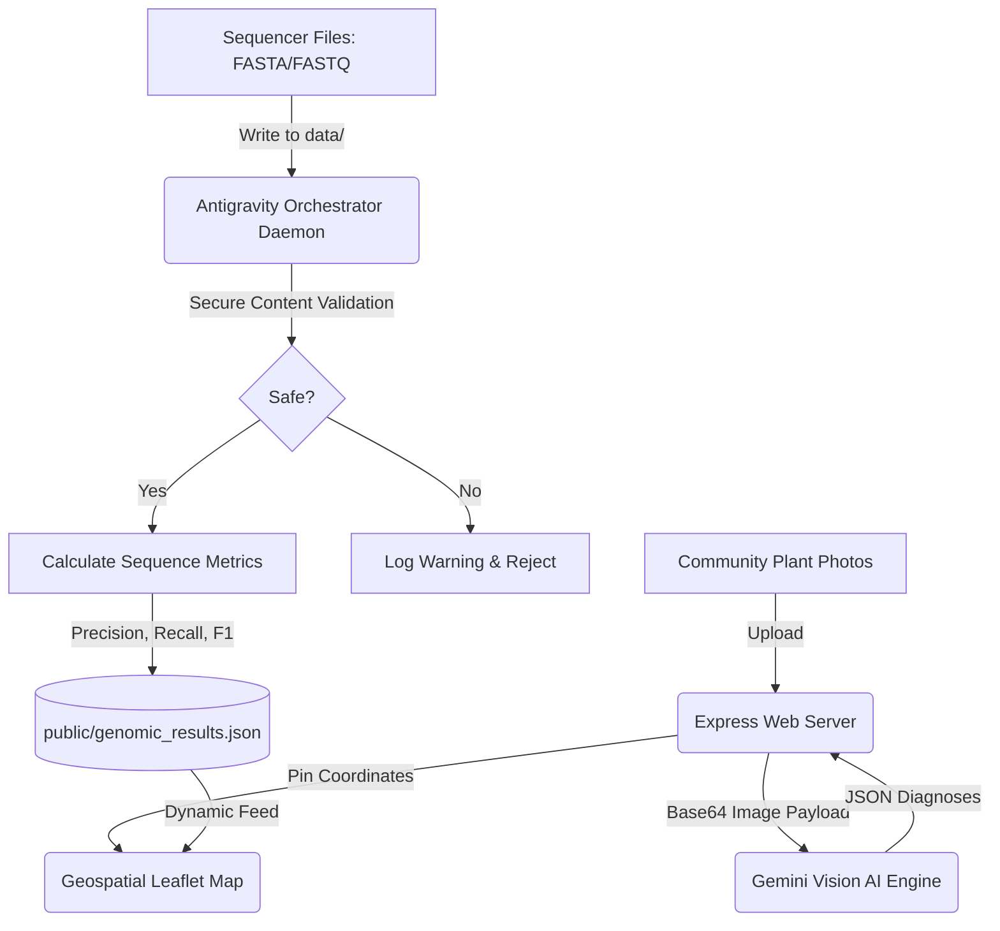

# 🌿 RootMap — Plant Health AI & Autonomous Genomic Mapping Pipeline

[](#)
[](#)
[](#)
[](#)
[](#)
[](#)

RootMap is a professional-grade, hybrid plant health diagnostic AI and genomic mapping pipeline built for **Biothon 2026**. The application pairs a modern, glassmorphic Node.js web dashboard with an autonomous, background Python bioinformatics orchestrator that monitors biological sequence inputs, verifies execution safety, and calculates alignment mapping statistics.

---

## 🚀 System Architecture Overview

The system consists of two highly decoupled modules interacting through a shared state interface:

1. **AI Plant Diagnostics & Live Map (Node.js/Express)**:
   - Integrates Gemini Vision AI (`gemini-1.5-flash`) for real-time plant species identification, stress diagnostics, and clinical treatment suggestions.
   - Embeds an interactive, high-performance geospatial map (Leaflet.js) to pin and visualize community plant scans in Amravati, India.

2. **Antigravity Genomic Orchestrator (Python 3.10+)**:
   - An autonomous background daemon (`antigravity_orchestrator.py`) monitoring the `data/` folder for FASTA/FASTQ sequence inputs.
   - Incorporates a secure validation engine checking for path traversal, DOS limits, shebangs, shell syntax injection, and IUPAC biological sequence compliance.
   - Calculates alignment metrics (Precision, Recall, F1-Scores) against model plant reference genomes and exports structured JSON feeds consumed by the frontend.



---

## 🛠️ Installation & Local Setup

### System Prerequisites
- **Python**: version 3.10 or higher
- **Node.js**: version 18.0.0 or higher
- **NPM**: version 9.0.0 or higher

---

### Step 1: Clone the Repository & Configure Environment Variables
Create a local `.env` file using the provided example:
```bash
cp .env.example .env
```
Open `.env` and fill in your actual credentials:
```env
GEMINI_API_KEY=your_actual_gemini_api_key
NCBI_API_KEY=your_actual_ncbi_api_key
PORT=3000
```

---

### Step 2: Node.js Server Setup
Install frontend and server dependencies and start the local development web server:
```bash
# Install dependencies
npm install

# Run in development mode (with nodemon auto-reload)
npm run dev
```
The server will bind to `http://localhost:3000`.

---

### Step 3: Python Environment & Orchestrator Daemon Setup
Set up a clean virtual environment, load dependencies, and launch the background pipeline:

```bash
# Create virtual environment
python -m venv .venv

# Activate virtual environment
# On Windows (PowerShell):
.venv\Scripts\Activate.ps1
# On macOS/Linux:
source .venv/bin/activate

# Install dependencies (such as python-dotenv)
pip install python-dotenv

# Verify static security using Bandit (Optional)
pip install bandit
bandit -r antigravity_orchestrator.py

# Launch the autonomous orchestrator daemon
python -u antigravity_orchestrator.py
```

The orchestrator will scan the `./data` directory, generate log outputs to `./pipeline_debug.log`, and export results directly to `./public/genomic_results.json`.

---

## 🐳 Production Deployment Guide

### Web Dashboard Deployment (Vercel)
RootMap includes a `vercel.json` configuration for frictionless edge hosting:
1. Push the repository to GitHub.
2. Link your repository in the Vercel Dashboard.
3. Configure `GEMINI_API_KEY` and `NCBI_API_KEY` under **Project Settings > Environment Variables**.
4. Click **Deploy**. Vercel will automatically serve static frontend files and proxy API calls.

### Production Daemon Deployment (Systemd Service)
To run the `antigravity_orchestrator.py` daemon persistently on a Linux server:

1. Create a service configuration file: `/etc/systemd/system/rootmap-orchestrator.service`
   ```ini
   [Unit]
   Description=RootMap Antigravity Genomic Pipeline Orchestrator
   After=network.target

   [Service]
   Type=simple
   User=rootmap-service
   WorkingDirectory=/var/www/RootMap
   ExecStart=/var/www/RootMap/.venv/bin/python -u /var/www/RootMap/antigravity_orchestrator.py
   Restart=on-failure
   RestartSec=5
   Environment=PYTHONUNBUFFERED=1
   Environment=ROOTMAP_DATA_DIR=/var/www/RootMap/data
   Environment=ROOTMAP_OUTPUT_PATH=/var/www/RootMap/public/genomic_results.json

   [Install]
   WantedBy=multi-user.target
   ```
2. Reload unit files, start, and enable the service:
   ```bash
   sudo systemctl daemon-reload
   sudo systemctl start rootmap-orchestrator
   sudo systemctl enable rootmap-orchestrator
   ```
3. Inspect logs in real-time:
   ```bash
   journalctl -u rootmap-orchestrator -f
   ```

---

## 🔒 Security Compliance
This project strictly follows bioinformatics secure coding standards. For detailed security configurations, lint rules, and safety checklist items, refer to [SECURITY_AUDIT.md](file:///c:/Users/lenovo/Downloads/RootMap/SECURITY_AUDIT.md).
